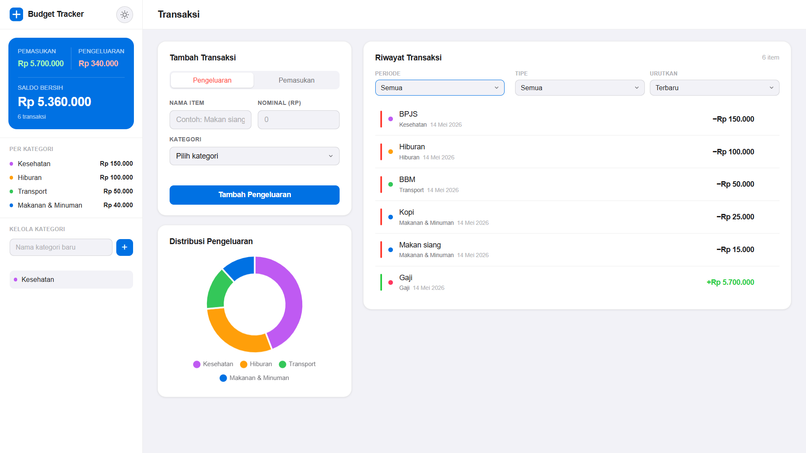
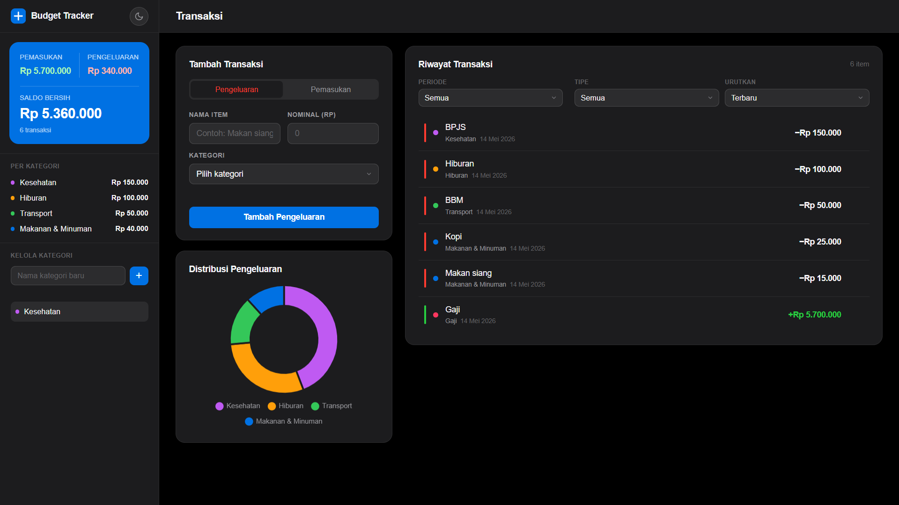

# 💰 Budget Tracker

Aplikasi web satu halaman yang responsif untuk mencatat pemasukan dan pengeluaran pribadi. Dibangun dengan JavaScript murni tanpa framework, dilengkapi ringkasan saldo real-time, grafik donat interaktif, filter periode fleksibel, serta dukungan tema gelap dan terang — tanpa instalasi atau server.

---

## 📸 Tangkapan Layar

| Tampilan Terang | Tampilan Gelap |
|---|---|
|  |  |

---

## ✨ Fitur Utama

### Transaksi
- Tambah transaksi **pemasukan** atau **pengeluaran** dengan nama, nominal, dan kategori
- Format Rupiah otomatis dengan pemisah ribuan saat mengetik
- Hapus transaksi kapan saja — saldo dan grafik langsung diperbarui
- Semua data tersimpan di **Local Storage** browser (tidak perlu server)

### Ringkasan Saldo
- Menampilkan total **pemasukan**, total **pengeluaran**, dan **saldo bersih** secara real-time
- Saldo bersih berubah merah ketika pengeluaran melebihi pemasukan

### Filter & Pengurutan
- Filter berdasarkan periode: **Semua**, **Hari Ini**, **Minggu Ini**, **Bulan Ini**, atau pilih bulan tertentu
- Filter berdasarkan tipe: **Semua**, **Pengeluaran**, atau **Pemasukan**
- Urutkan berdasarkan: **Terbaru**, **Terlama**, **Nominal Terbesar**, **Nominal Terkecil**, **Kategori A–Z / Z–A**

### Grafik Pengeluaran
- Grafik **donat interaktif** (Chart.js) yang menampilkan distribusi pengeluaran per kategori
- Tooltip menampilkan nominal dan persentase setiap kategori
- Grafik diperbarui otomatis saat transaksi ditambah atau dihapus

### Manajemen Kategori
- Kategori bawaan: `Makanan & Minuman`, `Transport`, `Hiburan`, `Gaji`
- Tambah dan hapus **kategori kustom** dari sidebar
- Setiap kategori mendapat warna unik yang konsisten di grafik dan daftar transaksi
- Kategori yang sedang digunakan oleh transaksi tidak dapat dihapus

### Tema Gelap / Terang
- Ganti tema dengan satu klik melalui tombol di sidebar
- Preferensi tema disimpan dan dipulihkan saat aplikasi dibuka kembali

### Responsif
- Layout sidebar + konten utama menyesuaikan semua ukuran layar
- Tombol dan kontrol ramah sentuh untuk pengguna mobile

---

## 🛠️ Teknologi yang Digunakan

| Teknologi | Kegunaan |
|---|---|
| HTML5 | Struktur dan semantik halaman |
| CSS3 | Tampilan, variabel CSS untuk tema, layout responsif |
| JavaScript (ES6+) | Seluruh logika aplikasi — tanpa framework |
| [Chart.js](https://www.chartjs.org/) | Visualisasi grafik donat (disertakan secara lokal) |
| Local Storage API | Penyimpanan data di sisi klien |

---

## 🚀 Cara Menjalankan

### Prasyarat
- Browser modern (Chrome, Firefox, Edge, atau Safari)
- Tidak memerlukan build tool, package manager, atau koneksi internet

### Langkah-langkah
1. Clone atau unduh repositori ini
2. Buka file `index.html` langsung di browser
3. Mulai mencatat transaksi

### Struktur Folder
```
budgetVisualitation/
├── index.html              # File HTML utama
├── css/
│   └── style.css           # Semua gaya dan variabel tema
├── js/
│   ├── app.js              # Seluruh logika aplikasi
│   └── chart.umd.min.js    # Chart.js (bundel lokal)
└── README.md               # File ini
```

---

## 📱 Cara Penggunaan

### Menambah Transaksi
1. Pilih **Pengeluaran** atau **Pemasukan** menggunakan tombol toggle
2. Isi nama item (contoh: `Makan siang`, `Gaji bulanan`)
3. Masukkan nominal — format Rupiah otomatis saat mengetik
4. Pilih kategori dari dropdown
5. Klik tombol tambah

### Memfilter Transaksi
- Gunakan dropdown **Periode** untuk mempersempit rentang waktu
- Pilih **Pilih Bulan...** untuk memilih bulan tertentu dari riwayat
- Gunakan dropdown **Tipe** untuk menampilkan hanya pengeluaran atau pemasukan

### Mengelola Kategori
- Ketik nama kategori baru di input sidebar lalu klik **+** atau tekan Enter
- Klik tombol **×** di samping kategori kustom untuk menghapusnya
- Kategori yang masih digunakan oleh transaksi tidak bisa dihapus

---

## 🔒 Privasi

Semua data tersimpan secara lokal di Local Storage browser kamu. Tidak ada data yang dikirim ke server mana pun.

---

## 💡 Pengembangan Selanjutnya

- Ekspor transaksi ke CSV atau PDF
- Notifikasi batas pengeluaran per kategori
- Tampilan ringkasan bulanan / analitik
- Dukungan multi-mata uang
- Dukungan PWA untuk penggunaan offline dan instalasi ke layar utama

---

## 📄 Lisensi

Proyek ini bersifat open source dan tersedia untuk keperluan edukasi.
